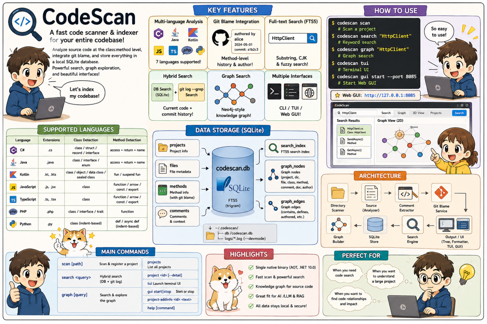
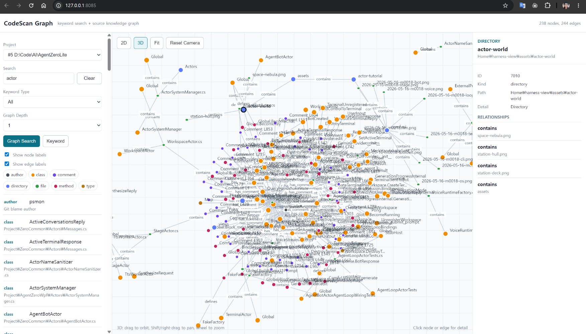
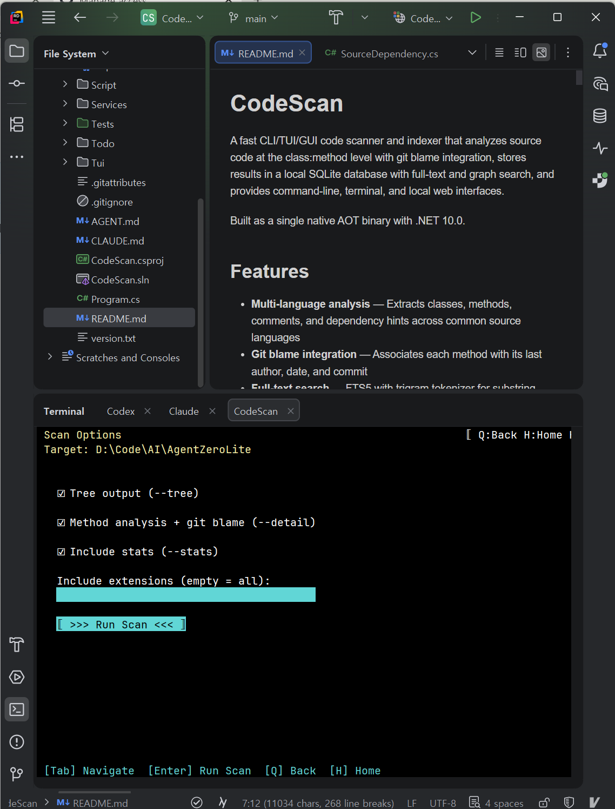
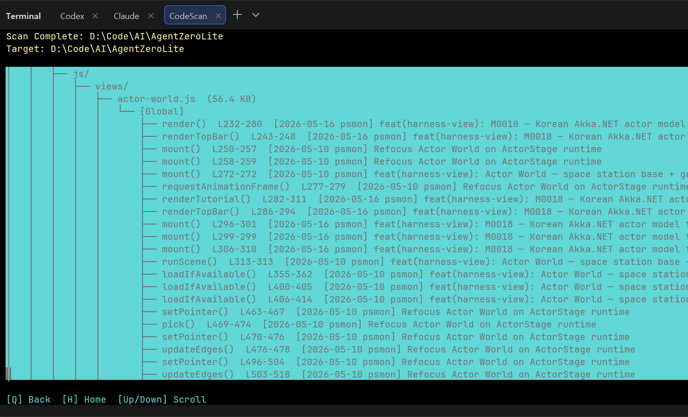
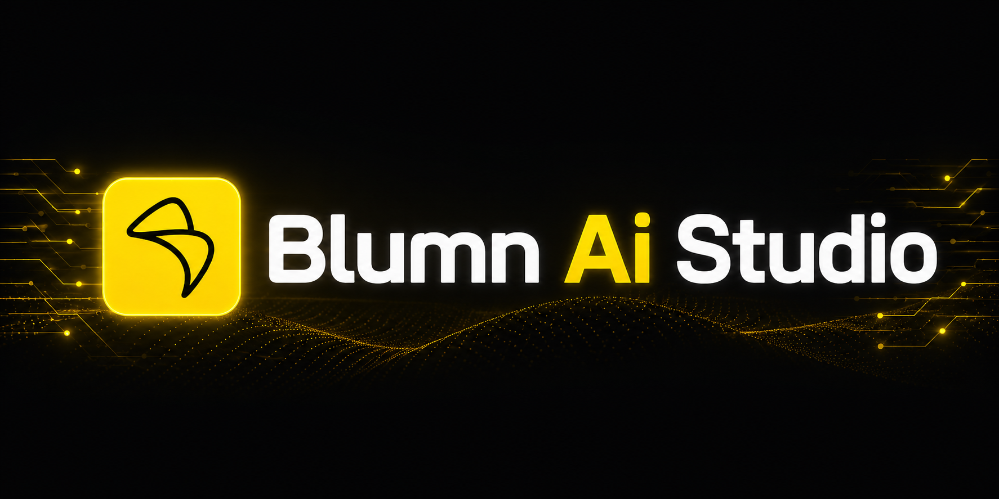

# CodeScan

> [English](README.md) · 한국어

소스 코드를 클래스:메서드 단위로 분석하고 git blame을 함께 묶어 로컬 SQLite에 풀텍스트 + 그래프 인덱스로 저장한 뒤, CLI / TUI / 로컬 웹 GUI 세 가지 인터페이스로 탐색하게 해 주는 빠른 코드 스캐너 & 인덱서입니다.

.NET 10.0 기반 Native AOT 단일 바이너리로 빌드됩니다.

<p align="center">
  
</p>

## 기능

- **다국어 분석** — 일반적인 소스 언어에서 클래스, 메서드, 주석, 의존성 힌트를 추출
- **Git blame 통합** — 각 메서드를 최종 작성자, 작성일, 커밋과 연결
- **풀텍스트 검색** — Trigram 토크나이저 기반 FTS5로 부분 문자열 및 CJK(한·중·일) 언어 지원
- **하이브리드 검색** — 인덱싱된 DB 검색과 라이브 `git log --grep` 결과를 함께 표시
- **그래프 검색** — Neo4j 스타일 소스 지식 그래프를 임베디드 SQLite에 저장. 재스캔 시 **증분 재조정**(리셋이 아니라 관계 재정렬), 엣지 weight = 확증 스캔 수(미관측 시 감쇠), 큐레이션 엣지는 보존
- **Cypher-like 그래프 질의** — 안전한 `MATCH ... WHERE ... LIMIT ...` 서브셋 + **가변 홉 경로**(`-[r*1..3]->`) + 지원 안 되는 쿼리를 **AI가 고쳐 쓰도록 안내하는 정보성 오류**
- **코드↔문서 그래프** — 코드 클래스를 명명한 마크다운 헤딩을 그 클래스에 연결(`mentions` 엣지) → "이 클래스를 설명하는 문서" 조회
- **하이브리드 의존성 그래프** — 정규식 1차 + 선택적 **빌드 산출물 수확**(예: JVM `.class` 상속, 툴체인 없이 읽음) + 언어/프로젝트 메타 프로브
- **인터랙티브 TUI** — Terminal.Gui v2 기반 탐색·스캔·키워드/그래프 검색·질의
- **로컬 웹 GUI** — 키워드/그래프/질의 검색 + 2D force 뷰어(**드래그 자석 물리**, 연결 수로 허브 크게), **깊이 광원 3D 뷰**(Labels/Lines/Cluster 토글), **그래프 내 파일 프리뷰**. 기본 포트 8085
- **프로젝트 관리** — 인덱싱된 프로젝트의 등록, 설명, 갱신, 삭제
- **단일 바이너리** — Native AOT 컴파일, 런타임 의존성 불필요

## 스크린샷

### 웹 GUI 그래프 뷰어

로컬 GUI는 키워드 검색, 그래프 검색·Cypher-like 질의(가변 홉·온보딩 샘플 포함), 노드/엣지 디테일(엣지 **weight** 포함)을 제공합니다. 주요 기능:

- **2D force 그래프** — 노드를 드래그하면 연결된 노드가 자석처럼 딸려옴(당김 세기 ∝ weight), 반발력으로 클러스터 가시성 유지, 연결 많은 허브는 크게.
- **깊이 광원 3D 뷰** — 가까운 노드는 밝게, 먼 노드는 어둡게(최소 밝기)로 진짜 깊이감. 뷰 내 **Labels / Lines / Cluster** 토글, Cluster는 연관 노드를 3D 공간에서 모음.
- **그래프 내 파일 프리뷰** — 노드의 `path`를 VS Code 스타일 팝업(라인번호·메서드 라인범위 하이라이트)으로 열어, 관계 뒤의 실제 내용을 그래프를 떠나지 않고 확인.



### 터미널 UI

TUI에서 프로젝트 탐색, 스캔, 프로젝트 관리, 키워드 검색, 그래프 검색을 터미널만으로 수행할 수 있습니다.



### TUI 스캔 플로우

터미널 인터페이스에서 메서드/주석 추출, git blame 보강, DB 그래프 인덱싱을 포함한 스캔을 바로 실행할 수 있습니다.



### AI 에이전트를 위한 설계 — 챗봇이 아니라 CLI 우선

CodeScan은 언어 모델을 **내장하지 않습니다.** 외부 AI 에이전트(Claude Code, Codex, 또는 온디바이스 SLM)가 CLI를 통해 구동하는 인덱싱·검색 레이어입니다. 모델을 바이너리 밖에 두는 것은 의도된 설계입니다 — Native AOT 산출물을 작고 의존성 없이 유지해, 수 GB GGUF나 GPU 백엔드를 함께 배포하지 않고도 같은 바이너리를 노트북·CI 러너·SBC에 그대로 떨어뜨릴 수 있게 합니다.

에이전트는 소스를 직접 읽기 전에 CodeScan의 구조적 검색 명령을 조합해 코드베이스를 탐색합니다(토큰 절약):

- `codescan search "<query>" --type method|file|doc|comment` — FTS5 전문검색
- `codescan query "MATCH (c:class)-[r:uses_type]->(t:type) LIMIT 20"` — SQL 없이 구조적 검색을 위한 Cypher-like 그래프 쿼리
- `codescan graph "<query>" --depth 2` — 매치 주변 이웃 확장
- `codescan project <id>` / `codescan projects` — 프로젝트 컨텍스트와 인덱싱된 메타데이터

> 이전 빌드는 온디바이스 Gemma/Nemotron 챗 루프를 TUI에 직접 내장했었습니다. CLI를 가볍게 유지하기 위해 제거했습니다 — 지속 가치는 검색 레이어에 있고, 모델은 경계의 에이전트 쪽에 있어야 합니다 (하단 [Why AOT? — Edge AI 트렌드와 단일 바이너리의 가치](#why-aot--edge-ai-트렌드와-단일-바이너리의-가치) 참조).

## 지원 언어

| 언어 | 확장자 | 클래스/타입 인식 | 메서드 인식 | 의존성 힌트 |
|------|--------|------------------|--------------|--------------|
| C# | `.cs` | class / struct / record / interface | 접근자 + 반환형 + 이름 | using, 상속/인터페이스, `new`, 타입 사용 |
| Java | `.java` | class / interface / enum | 접근자 + 반환형 + 이름 | import, extends/implements, `new`, 타입 사용 |
| Kotlin | `.kt`, `.kts` | class / object / data class / sealed class | fun / suspend fun | import, 기반 타입, 생성자/타입 사용 |
| JavaScript | `.js`, `.jsx` | class | function / arrow / const / export | import, extends/implements 류 힌트, `new`, 타입 유사 사용 |
| TypeScript | `.ts`, `.tsx` | class | function / arrow / const / export | import, extends/implements, `new`, 타입 어노테이션 |
| PHP | `.php` | class / interface / trait | function | use, extends/implements, `new`, 타입 힌트 |
| Python | `.py` | class (들여쓰기 기반) | def / async def (들여쓰기 기반) | import, 베이스 클래스, 생성자 유사 호출 |
| Go | `.go` | type struct/interface | 그래프 의존성 스캔만 | import, 생성자/타입 사용 |
| Rust | `.rs` | struct / enum / trait | 그래프 의존성 스캔만 | use, 연관 생성자/타입 사용 |
| C/C++ | `.c`, `.cc`, `.cpp`, `.cxx`, `.h`, `.hpp`, `.hh`, `.hxx` | class / struct | 그래프 의존성 스캔만 | include, 상속, `new`, 타입 사용 |

## 설치

<p align="center">
  
</p>

<p align="center"><sub>하나의 릴리즈 파이프라인 → 네 개의 네이티브 바이너리 → 세 개의 패키지 채널. <a href="https://github.com/psmon/CodeScan/actions/workflows/release.yml">GitHub Actions release.yml</a></sub></p>

### ⚡ 가장 쉬운 설치 — 한 줄, 모든 OS

CodeScan은 **npm**으로 설치하며, **Windows · macOS · Linux 모두 동일하게** 동작합니다. [Node.js](https://nodejs.org/)만 있으면 명령 한 줄이면 끝납니다:

```bash
npm install -g @webnori/codescan-cli
```

**Linux / macOS**에서는 시스템 Node가 npm 글로벌 폴더를 root 소유로 두기 때문에 `sudo`를 붙입니다:

```bash
sudo npm install -g @webnori/codescan-cli
```

설치 후 바로 확인하고 첫 프로젝트를 스캔하세요:

```bash
codescan --version              # codescan v0.8.0 (또는 그 이상)
codescan scan /path/to/project  # 코드베이스 인덱싱
codescan tui                    # 대화형 터미널 UI
```

대부분의 사용자는 여기까지면 충분합니다. npm 패키지는 얇은 래퍼로, `postinstall` 단계에서 OS에 맞는 네이티브 바이너리(`win-x64`, `linux-x64`, `linux-arm64`, `osx-arm64`)를 GitHub Releases에서 받아옵니다. **.NET 런타임 설치 불필요.**

> **반드시 스코프 붙은 `@webnori/codescan-cli`로 설치하세요** (`@webnori/` 접두사 포함). 짧은 `codescan-cli`는 무관한 제3자가 선점한 깨진 패키지입니다 — 문제가 생기면 [설치 트러블슈팅](#설치-트러블슈팅)을 참고하세요.

<details>
<summary><b>Node.js가 없거나, 네이티브 패키지 매니저를 선호한다면?</b> &nbsp;— winget · Homebrew · 직접 인스톨러 · 소스 빌드</summary>

<br>

**Windows — winget** (Node.js 불필요, PATH 자동 처리):

```powershell
winget install psmon.CodeScan
```

**macOS — Homebrew** (Apple Silicon / arm64):

```bash
brew install psmon/codescan/codescan
```

**모든 OS — 직접 인스톨러** (패키지 매니저 없이, 특정 릴리즈 고정 가능):

```powershell
# Windows (PowerShell)
iwr https://raw.githubusercontent.com/psmon/CodeScan/main/Script/install-win.ps1 -OutFile install-win.ps1
.\install-win.ps1                       # 최신
.\install-win.ps1 -Version 0.8.0        # 버전 고정
```

```bash
# Linux / macOS (bash)
curl -fsSL https://raw.githubusercontent.com/psmon/CodeScan/main/Script/install.sh -o install.sh
sh install.sh                           # 최신
sh install.sh --version 0.8.0           # 버전 고정
```

직접 인스톨러는 GitHub에서 해당 릴리즈 자산을 받아 `checksums.txt` 기준 SHA256을 검증하고, 사용자 로컬 경로(Win: `~/.codescan/bin`, Unix: `~/.local/bin`)에 설치하며, `~/.codescan/{db,logs,config}`의 **사용자 데이터는 절대 건드리지 않습니다**.

**소스에서 빌드** — 아래 [소스에서 빌드](#소스에서-빌드) 참고.

</details>

### 설치 트러블슈팅

<details>
<summary><b>자주 겪는 설치 이슈 & 채널 상태</b> &nbsp;— npm 이름, sudo/EACCES, 오프라인/프록시, Linux 아키텍처, winget 로컬 테스트, 채널 상태</summary>

<br>

**⚠ 반드시 스코프 붙은 `@webnori/codescan-cli`로 설치하세요.** 우리가 publish하기 전에 무관한 제3자가 npm에서 짧은 이름 `codescan-cli`를 선점했습니다. 그 패키지는 ESM/CJS 충돌 버그가 있어 `codescan` 실행 즉시 죽으며 CodeScan과는 아무 관련이 없습니다. 잘못 설치했다면:

```bash
npm uninstall -g codescan-cli
npm install -g @webnori/codescan-cli
```

**sudo 없이 Linux에서 `EACCES` / 권한 오류.** 시스템 패키지로 깐 Node는 npm 글로벌 prefix(`/usr/local/lib/node_modules/`)가 root 소유라 일반 사용자의 `npm install -g`가 실패합니다. `sudo`를 붙이거나, **nvm/fnm**으로 Node를 사용자 홈에 두거나(sudo 불필요), 위의 직접 인스톨러를 쓰세요.

**오프라인 / 회사 프록시 / 에어갭.** `postinstall`이 GitHub에 도달할 수 없으면 설치 시 `CODESCAN_SKIP_DOWNLOAD=1`을 지정하고 [최신 릴리즈](https://github.com/psmon/CodeScan/releases/latest)에서 바이너리를 직접 받으세요.

**Linux: x64 vs arm64.** npm 래퍼는 CPU 아키텍처를 자동 감지합니다:

| `process.arch` | 다운로드 자산 |
|----------------|----------------|
| `x64` | `codescan-linux-x64.tar.gz` |
| `arm64` | `codescan-linux-arm64.tar.gz` |

v1은 **glibc 기반 Linux만** 지원합니다. musl/Alpine 지원은 v2 검토 사항입니다.

**Windows에서 winget 로컬 테스트** (`microsoft/winget-pkgs` PR 머지 전). 관리자 권한 PowerShell에서 한 번만 로컬 매니페스트 허용:

```powershell
winget settings --enable LocalManifestFiles
```

이후 일반 권한으로 저장소 안 매니페스트에서 설치:

```powershell
winget install --manifest packaging\winget\manifests\p\psmon\CodeScan\0.8.0
codescan --version
```

나중에 끄려면: `winget settings --disable LocalManifestFiles` (관리자).

**채널 상태 (v1).** GitHub Release 파이프라인은 이미 가동 중이고 모든 채널이 가져갈 바이너리를 만들고 있습니다.
- **npm (`@webnori/codescan-cli`)** — 패키지는 [`packaging/npm/codescan-cli/`](packaging/npm/codescan-cli/)에 준비됨. 반드시 스코프 붙은 이름을 사용; 짧은 `codescan-cli`는 무관한 제3자가 선점 중.
- **Homebrew tap** — [`psmon/homebrew-codescan`](https://github.com/psmon/homebrew-codescan)에 라이브. Apple Silicon Mac에서 `brew tap psmon/codescan && brew install codescan` 바로 동작.
- **winget** — 매니페스트는 [`packaging/winget/manifests/p/psmon/CodeScan/`](packaging/winget/manifests/p/psmon/CodeScan/)에 준비됨. `microsoft/winget-pkgs` PR 머지 대기 중. 머지 전까지는 위 방법으로 로컬 테스트.

**왜 이 채널들인가?** npm은 모든 OS에서 통용되고 네 개 바이너리(`linux-x64`, `linux-arm64`, `osx-arm64`, `win-x64`)를 하나의 래퍼로 제공할 수 있어 주 경로로 삼았습니다. winget은 Windows 사용자에게 Node 없는 선택지를, Homebrew는 macOS 표준(v1은 arm64만; Intel Mac은 소스 빌드 또는 Rosetta)을 제공합니다. **Linux arm64는 의도된 1급 타깃** — arm64 SBC(Raspberry Pi / Jetson / Latte Panda) 배포가 왜 핵심 미래 시나리오인지는 [Why AOT? — Edge AI 트렌드](#why-aot--edge-ai-트렌드와-단일-바이너리의-가치)를 참고하세요.

</details>

### 사용자 데이터 위치

| OS | 바이너리 설치 경로 | 사용자 데이터 |
|----|---------------------|----------------|
| Windows | `%USERPROFILE%\.codescan\bin` (또는 winget 관리) | `%USERPROFILE%\.codescan\{db,logs,config}` |
| Linux | `~/.local/bin` (또는 npm 관리) | `~/.codescan/{db,logs,config}` |
| macOS | `$(brew --prefix)/bin` | `~/.codescan/{db,logs,config}` |

설치 / 업그레이드 / 제거 전 과정에서 사용자 데이터는 보존됩니다.

### 소스에서 빌드

```bash
git clone https://github.com/psmon/CodeScan.git
cd CodeScan
dotnet build                        # 디버그 빌드
dotnet publish -c Release           # 릴리즈 publish (단일 파일)
```

전제 조건:

- [.NET 10.0 SDK](https://dotnet.microsoft.com/) (빌드용)
- Git (blame 통합용)

산출물: `bin/Release/net10.0/<rid>/codescan` (Windows는 `codescan.exe`).

### 개발자 배포 스크립트

GitHub Releases를 거치지 않고 로컬 체크아웃에서 바로 설치하고 싶은 저장소 개발자용:

- **Windows:** `Script/deploy-win.ps1`
- **Linux:** `Script/deploy-linux.sh`

`dotnet publish` + `~/.codescan/bin` 설치 + PATH 등록까지 한 번에 처리합니다 — 로컬 개발 시 편리하지만 일반 사용자에게 권장하는 경로는 아닙니다.

### 배포 전략 상세

자산 명명, 코드 서명/공급망 정책, SBOM, CI 흐름, 채널 제출 절차 등 v1 확정안은 [`Docs/install-distribution-strategy.md`](Docs/install-distribution-strategy.md)를 참고하세요.

## 사용법

### 빠른 시작

```bash
# 현재 디렉토리 스캔 (등록 + 분석 + 표시)
codescan scan

# 특정 경로 스캔
codescan scan /path/to/project

# 인덱싱된 모든 프로젝트에서 검색
codescan search "HttpClient"

# 그래프 검색
codescan graph "HttpClient"
codescan search "HttpClient" --graph --depth 2

# Cypher-like 그래프 질의
codescan query "MATCH (c:class)-[r:uses_type]->(t:type) WHERE t.label = 'HttpClient'"

# 인터랙티브 TUI 실행
codescan tui

# 로컬 GUI 뷰어 시작
codescan gui start --port 8085
```

### CLI 명령

| 명령 | 설명 |
|------|------|
| `scan [path]` | 디렉토리 등록 + 분석 (기본 옵션으로 list 실행하는 단축형) |
| `list <path>` | 사용자 정의 필터/출력 옵션으로 스캔 |
| `search <query>` | 풀텍스트 + git log 하이브리드 검색 |
| `graph [query]` | 소스 지식 그래프 검색 및 조회 |
| `query <graph-query>` | CodeScan Cypher-like 그래프 질의 서브셋 실행 |
| `cypher <graph-query>` | `query`의 별칭 |
| `gui start|stop` | 로컬 웹 GUI 뷰어 시작/정지 |
| `projects` | 등록된 모든 프로젝트와 통계 나열 |
| `project <id>` | 프로젝트 요약 또는 `--detail`로 전체 보기 |
| `project-addinfo <id> <text>` | 프로젝트에 AI 친화적 설명 추가 |
| `project-update <id>` | 프로젝트 경로/설명 갱신 |
| `project-delete <id>` | 데이터베이스에서 프로젝트 제거 |
| `tui` | 인터랙티브 터미널 UI 실행 |
| `help [command]` | 특정 명령의 도움말 표시 |

### 검색 옵션

```bash
# 메서드 검색
codescan search "async" --type method

# 주석 검색
codescan search "TODO" --type comment

# 특정 프로젝트 내 검색
codescan search "config" --project 1

# 그래프 검색
codescan search "HttpClient" --graph --depth 2
codescan graph "SearchCommand" --project 1

# 검색 인자를 그래프 질의로 처리
codescan search "MATCH (f:file)-[r:imports]->(m:module) LIMIT 20" --query
```

### 그래프 질의

CodeScan은 자체 그래프 데이터에 맞춰 Cypher-like 질의 서브셋을 제공합니다. CLI 사용자, AI 에이전트, 자동화 스크립트가 SQL을 직접 다루지 않고도 구조화된 그래프 조회를 할 수 있도록 설계되었습니다.

이것은 전체 Cypher가 아닙니다. CodeScan의 SQLite 기반 소스 그래프에 매핑되며, CLI/TUI/GUI가 렌더링할 수 있는 `GraphData` 결과를 반환합니다.

지원 패턴:

```cypher
MATCH (n:kind)
MATCH (a:kind)-[r:edge_kind]->(b:kind)
```

지원 `WHERE` 필드:

| 별칭 종류 | 필드 |
|-----------|------|
| 노드 별칭 | `kind`, `label`, `path`, `detail` |
| 엣지 별칭 | `kind`, `label` |

지원 연산자:

| 연산자 | 예시 |
|--------|------|
| `=` | `t.label = 'HttpClient'` |
| `CONTAINS` | `c.label CONTAINS 'Command'` |
| `STARTS WITH` | `m.label STARTS WITH 'System'` |
| `ENDS WITH` | `f.path ENDS WITH '.cs'` |

지원 절:

| 절 | 동작 |
|----|------|
| `WHERE ... AND ...` | 매칭된 노드/엣지 필터링 |
| `RETURN ...` | 가독성을 위해 허용, 렌더러는 무시 |
| `LIMIT <n>` | 매칭된 시드 노드/엣지 개수 제한 |

예시:

```bash
# 클래스 노드 검색
codescan query "MATCH (c:class) WHERE c.label CONTAINS 'Service' LIMIT 20"

# 특정 타입을 사용하는 클래스 검색
codescan query "MATCH (c:class)-[r:uses_type]->(t:type) WHERE t.label = 'HttpClient'"

# 파일 임포트 검색
codescan query "MATCH (f:file)-[r:imports]->(m:module) WHERE m.label CONTAINS 'System.Net'"

# 작성자-메서드 관계 검색 및 이웃 한 단계 확장
codescan query "MATCH (a:author)-[r:authored]->(m:method) WHERE a.label CONTAINS 'kim'" --depth 1

# `graph`는 MATCH 질의를 자동 감지
codescan graph "MATCH (c:class)-[r:creates]->(t:type) LIMIT 30"
```

주요 노드 종류:

`project`, `directory`, `file`, `class`, `method`, `comment`, `doc`, `author`, `type`, `module`

주요 엣지 종류:

`contains`, `defines`, `authored`, `has_comment`, `documents`, `imports`, `inherits_or_implements`, `creates`, `uses_type`

### GUI

```bash
# 기본 포트로 시작
codescan gui start

# 사용자 정의 포트로 시작
codescan gui start --port 8090

# GUI 서버 정지
codescan gui stop
```

GUI 시작 후 `http://127.0.0.1:8085/`를 엽니다. 뷰어는 키워드 검색, 그래프 검색, Cypher-like 그래프 질의, Neo4jClient 스타일 2D 그래프 캔버스, 카메라 제어 가능한 3D 그래프 뷰를 제공합니다.

GUI 그래프 컨트롤:

| 컨트롤 | 동작 |
|--------|------|
| `Keyword` | 풀텍스트 키워드 검색 실행 |
| `Graph Search` | 키워드로 그래프 노드 검색 및 이웃 확장 |
| `Query` | `MATCH ...` 그래프 질의 실행 및 렌더링 |
| 2D 배경 드래그 | 그래프 패닝 |
| 2D 마우스 휠 | 커서 기준 줌 |
| 2D 노드 드래그 | 노드 위치 재배치 |
| 노드 클릭 | 노드 디테일 + 가시 관계 표시 |
| 엣지 클릭 | 관계 디테일 표시 |
| 범례 칩 | 노드 종류 토글 |
| `Fit` | 가시 노드를 캔버스에 맞춤 |
| `Reset Camera` | 2D 뷰포트 또는 3D 카메라 리셋 |
| 3D 드래그 | 카메라 궤도 회전 |
| 3D Shift-드래그 / 오른쪽 드래그 | 카메라 패닝 |
| 3D 마우스 휠 | 카메라 줌 |

### list 옵션

```bash
# 메서드 디테일까지 트리 뷰
codescan list /path/to/project --detail --tree

# 확장자 필터
codescan list /path --include .ts,.tsx

# 깊이 제한 + git blame 포함
codescan list /path --depth 3 --blame
```

## 데이터 저장소

모든 데이터는 `~/.codescan/` 아래에 저장됩니다:

```
~/.codescan/
├── db/
│   └── codescan.db      # FTS5 인덱스가 포함된 SQLite DB
└── logs/
    └── *.log            # 스캔 로그 (--devmode 한정)
```

### 데이터베이스 테이블

| 테이블 | 내용 |
|--------|------|
| `projects` | 인덱싱된 프로젝트의 경로, 스캔 일시, 통계 |
| `scans` | 프로젝트별 스캔 이력 |
| `files` | 파일 메타데이터 (경로, 크기, 확장자, 깊이) |
| `methods` | git blame 데이터를 포함한 클래스:메서드 정의 |
| `comments` | 주변 코드 컨텍스트가 포함된 주석 블록 |
| `project_docs` | 자동 발견된 README / AGENT / CLAUDE.md 내용 |
| `search_index` | FTS5 가상 테이블 (trigram 토크나이저) |
| `graph_nodes` | 소스 그래프 노드: 프로젝트, 디렉토리, 파일, 클래스, 메서드, 주석, 문서, 작성자 |
| `graph_edges` | 소스 그래프 관계: contains, defines, authored, documents, comments, imports, creates, uses_type, inherits_or_implements |

### 그래프 엣지 규칙

구조 엣지:

| 엣지 | 의미 |
|------|------|
| `project -[contains]-> directory/file` | 프로젝트 파일 트리 |
| `directory -[contains]-> directory/file` | 디렉토리 파일 트리 |
| `file -[contains]-> class` | 소스 파일에서 발견된 클래스/타입 |
| `class/file -[defines]-> method` | 메서드/함수 정의 |
| `file -[has_comment]-> comment` | 소스 파일에서 발견된 주석 블록 |
| `author -[authored]-> method` | git blame 최종 작성자 관계 |
| `project -[documents]-> doc` | 자동 발견된 프로젝트 문서 |

의존성 힌트 엣지:

| 엣지 | 출처 |
|------|------|
| `file/class -[imports]-> module` | `using`, `import`, `use`, `#include` |
| `class -[inherits_or_implements]-> type` | 베이스 클래스 / 인터페이스 / trait 스타일 선언 |
| `class -[creates]-> type` | 생성자 또는 `new Type()` 같은 생성자 유사 호출 |
| `class -[uses_type]-> type` | 정규식 전략이 감지한 타입 어노테이션, 필드, 매개변수, 반환, 지역 선언 |

의존성 그래프는 의도적으로 하이브리드입니다. CodeScan은 먼저 언어 중립적 정규식 전략을 사용하므로 프로젝트가 빌드되지 않아도 그래프 엣지가 존재합니다. 동시에 프로젝트 메타데이터로 의미 분석 가능성을 탐지합니다:

| 언어 | 의미 분석 프로브 |
|------|-------------------|
| C# | 향후 Roslyn 분석을 위한 `.sln`, `.csproj` |
| Java | 향후 JDT/Spoon 분석을 위한 `pom.xml`, `build.gradle`, `build.gradle.kts` |
| TypeScript/JavaScript | 향후 TypeScript Compiler API 분석을 위한 `tsconfig.json`, `jsconfig.json` |
| Go | 향후 `go/packages` 분석을 위한 `go.mod`, `go.work` |
| Rust | 향후 rust-analyzer / Cargo 메타데이터 분석을 위한 `Cargo.toml` |
| C/C++ | 향후 Clang LibTooling 분석을 위한 `compile_commands.json` |

현재 의미 분석 프로브는 필요한 프로젝트 모델 존재 여부만 감지합니다. 언어별 의미 분석 전략이 추가될 때까지는 정규식이 기본 폴백 전략입니다.

## 아키텍처

```
CodeScan/
├── Program.cs                  # 진입점 및 CLI 라우팅
├── Commands/                   # 명령 구현
├── Models/                     # 데이터 구조 (FileEntry, MethodEntry, CommentBlock, SourceDependency)
├── Services/                   # 핵심 로직
│   ├── DirectoryScanner.cs     #   필터링 포함 재귀 순회
│   ├── SourceAnalyzer.cs       #   다국어 클래스/메서드 추출
│   ├── SourceGraphAnalyzer.cs  #   하이브리드 의존성 엣지 추출
│   ├── CommentExtractor.cs     #   컨텍스트 포함 주석 추출
│   ├── GitBlameService.cs      #   메서드별 git blame
│   ├── GitLogSearchService.cs  #   하이브리드 git log 검색
│   ├── GraphQuery.cs           #   Cypher-like MATCH 질의 파서
│   ├── GraphModels.cs          #   소스 그래프 DTO
│   ├── SqliteStore.cs          #   FTS5 풀텍스트 검색을 갖춘 SQLite DB
│   └── TreeFormatter.cs        #   트리/플랫 출력 포맷팅
├── Tui/
│   └── TuiApp.cs               # Terminal.Gui v2 인터랙티브 UI
└── Script/                     # 배포 스크립트 (Windows/Linux)
```

## 의존성

| 패키지 | 용도 |
|--------|------|
| [Microsoft.Data.Sqlite](https://www.nuget.org/packages/Microsoft.Data.Sqlite) | FTS5 지원 임베디드 SQLite |
| [Terminal.Gui v2](https://github.com/gui-cs/Terminal.Gui) | 크로스 플랫폼 터미널 UI 프레임워크 |

## 설계 하이라이트

- **중앙집중식 저장** — 도구가 실행되는 위치와 무관하게 모든 데이터는 `~/.codescan/` 아래
- **최신순 정렬** — 파일과 디렉토리는 수정 시간 기준 내림차순
- **스마트 기본값** — `.git`, `node_modules`, `bin`, `obj`, `dist`, `build`, `__pycache__`는 자동 제외
- **마크다운은 항상 포함** — `--include` 필터가 활성화되어도 `.md` 파일은 항상 인덱싱
- **Git 루트 감지** — 서브프로세스 없이 디렉토리 트리를 거슬러 올라가 `.git/`을 탐색
- **Trigram FTS** — 한·중·일 CJK 언어의 효과적인 부분 문자열 검색을 가능하게 함
- **정규식 우선 그래프** — 빌드 성공 없이도 의존성 그래프 힌트 생성
- **의미 분석 준비된 전략 레이어** — `ISourceDependencyStrategy` 뒤에 언어별 컴파일러 분석을 추가할 수 있음

## Why AOT? — Edge AI 트렌드와 단일 바이너리의 가치

> **TL;DR** — 2026~2027년 AI 인프라의 무게중심이 클라우드의 거대 프론티어 모델에서 *온디바이스 SLM(Small Language Model)*과 *엣지 에이전트*로 빠르게 옮겨가고 있습니다. CodeScan은 .NET 10 Native AOT로 빌드된 **런타임 의존성 없는 단일 바이너리** — 이 흐름을 함께 타도록 설계되었습니다. 개발자의 노트북, 라즈베리 파이, 드론급 SBC에서 모두 동일한 산출물이 그대로 동작합니다.

### 2026: SLM이 엣지에서 진짜로 돌아가기 시작한 해

2025년까지의 "엣지 LLM"은 데모와 벤치마크 글 수준에 머물러 있었습니다. 2026년부터 분위기가 달라졌습니다:

- **Google Gemma 3 / 3n / 3 270M** — Gemma 3는 라즈베리 파이에서 **14.5 tok/s**를 기록했고, Jetson에서 **12시간 무중단 추론**을 메모리 누수 없이 통과했습니다. 270M 변종은 INT4 양자화 + Per-Layer Embedding(PLE) 캐시로 Pixel 9 Pro에서 **25회 대화에 배터리 0.75%**만 소모 — 일상 기기에 자연스럽게 탑재되는 수준에 진입했습니다. ([Gemma 3 270M 발표](https://developers.googleblog.com/en/introducing-gemma-3-270m/), [Gemma 3n 개요](https://ai.google.dev/gemma/docs/gemma-3n))
- **NVIDIA Nemotron 3 Nano (4B / 30B-A3B)** — 하이브리드 Mixture-of-Experts 구조로, 30B 파라미터 중 forward pass당 **3B만 활성화**됩니다. 4B 변종은 4bit 양자화 시 **VRAM 3GB 미만**으로 컨슈머 RTX 카드와 Jetson급 엣지 보드에서 동작하며, NVIDIA는 동급 오픈 모델 대비 **9배 처리량**을 주장합니다. ([Nemotron 3 Nano Omni 소개](https://developer.nvidia.com/blog/nvidia-nemotron-3-nano-omni-powers-multimodal-agent-reasoning-in-a-single-efficient-open-model/), [Nemotron 3 Nano 4B 하이브리드 아키텍처](https://news.skrew.ai/nvidia-nemotron-3-nano-4b-hybrid-architecture-edge-ai/))
- **3B 파라미터 모델이 2026년 sweet spot** — 3~8bit 양자화가 양산 수준으로 안정화되고 소형 NPU가 단일 보드 컴퓨터에 본격 탑재되면서, 커뮤니티가 **약 3B 파라미터**를 SBC 추론의 실용적 sweet spot으로 수렴시켰습니다. ([The Small Model Revolution 2026](https://dev.to/linou518/the-small-model-revolution-2026-3b-parameters-on-raspberry-pi-edge-ais-new-sweet-spot-3pp4))

### 2027 예측: 작은 장치가 LLM을 *기본*으로 탑재한다

지금의 곡선을 그대로 외삽하면, 2027년에는 다음이 표준이 될 가능성이 높습니다:

- **드론** — Whisper급 음성 인식 + 3B급 SLM이 GPS 없이도 자율 임무 해석/재계획을 수행 (현재의 학술 데모 → 양산 페이로드 단계로 진입).
- **Raspberry Pi 5 + AI HAT+ 2** — Hailo-10H 가속기(**40 TOPS INT4**) + 8GB LPDDR4X로 SBC가 본격적인 LLM 호스트가 됨. ([Raspberry Pi AI HAT+ 2 출시 — The Register, 2026년 1월](https://www.theregister.com/2026/01/15/pi_5_ai_hat_2/))
- **x86/ARM SBC (Latte Panda, Khadas Edge, Orange Pi 등)** — 공장 PLC 옆에서 로컬 SLM이 로그 분류, 이상 탐지, 자연어 운용 UI를 담당.
- **노트북/태블릿** — NPU 내장 SoC(Apple Silicon, Snapdragon X, AMD Strix Halo)가 보편화되며 4B급 온디바이스 추론이 **OS 레벨 기본 기능**으로 자리잡음. Samsung·Google·Motorola의 2026 플래그십은 이미 Q4 양자화 4B 모델을 지원합니다. ([2026 SLM 비교: Phi-4 vs Gemma 3 vs Qwen](https://aegisai.in/best-small-language-models-for-edge-devices-2026-slm-comparison-phi-4-gemma-3-qw/))

이 모든 환경의 **공통 구조적 제약**:

| 제약 | 시사점 |
|------|--------|
| **런타임 부재** — 드론 펌웨어와 SBC 미니멀 이미지에는 .NET / Java / Python 런타임이 거의 없고, 추가 비용도 큽니다 | 단일 self-contained 바이너리가 사실상 요구사항 |
| **메모리/저장 압박** — 모델이 RAM을 거의 점유하므로 주변 도구는 작아야 합니다 | AOT 트리밍과 단일 파일 압축이 의미를 가짐 |
| **콜드 스타트 비용** — 배터리 구동 및 이벤트 트리거 워크로드는 즉시 응답해야 합니다 | "JIT warmup 없음"이 결정적 이점 |
| **공급망 신뢰** — 엣지는 업데이트가 드물어 한 번 박힌 산출물의 무결성이 더 중요합니다 | 단일 파일 + SHA256 + SBOM 조합이 자연스럽게 부합 |

### Native AOT 단일 바이너리가 부합하는 지점

CodeScan의 빌드 형태가 이 제약 각각에 정확히 들어맞습니다:

- **즉시 시작 (JIT 없음)** — 엣지 에이전트가 음성 트리거 후 약 50ms 안에 응답해야 하는 시나리오에서 결정적 차이를 만듭니다. ([Native AOT 배포 개요 — Microsoft Learn](https://learn.microsoft.com/en-us/dotnet/core/deploying/native-aot/))
- **런타임 비의존 단일 파일** — `~/.codescan/bin/codescan` 하나만 복사하면 .NET이 설치되지 않은 라즈베리 파이에서도 그대로 동작합니다.
- **메모리 풋프린트 축소** — AOT는 JIT, 그 메타데이터, 도달 불가능한 런타임 서비스를 제거하므로 모델에 더 많은 RAM을 양보합니다.
- **공격 표면 감소** — 동적 코드 생성과 대부분의 리플렉션 경로가 제거되며, 단일 파일 + SBOM 동봉은 공급망 감사에 친화적입니다.
- **multi-arch 1급 지원** — v1부터 동일 파이프라인이 `linux-x64`, `linux-arm64`, `osx-arm64`, `win-x64`를 동등하게 게시합니다. SBC 배포에 별도의 빌드 절차가 필요 없습니다.

### CodeScan이 엣지 AI 워크플로우에서 맡을 수 있는 역할

CodeScan이 직접 LLM을 호스트하지는 않습니다. 대신 에이전트가 코드와 상호작용할 때 필요한 **인덱싱·검색 레이어**입니다:

- SBC에서 도는 코드 인지형 에이전트(예: Gemma 3 4B + tool-use)가 로컬 저장소를 빠르게 훑을 수 있게 해 주는 FTS5 + 그래프 백엔드
- 자율 빌드/배포 봇이 변경 영향 범위를 추론할 때 사용할 수 있는 Cypher-like 그래프 질의 표면
- 드론·로봇 SDK 저장소를 오프라인에서 분석하여 코드 컨텍스트를 SLM에 주입하는 RAG-lite 컴포넌트

#### 자매 프로젝트: AgentZeroLite

위 그림에서 "에이전트" 쪽은 자매 연구 프로젝트로 함께 만들어지고 있습니다 — [**psmon/AgentZeroLite**](https://github.com/psmon/AgentZeroLite). AgentZeroLite는 위에서 언급한 Gemma 3 / Nemotron Nano 급 **온디바이스 SLM을 실제 컨슈머 등급 하드웨어 위에서 돌리고 평가하는 것**에 집중하고, CodeScan은 그 에이전트가 호출하는 코드 인지형 검색 레이어 역할을 합니다. 두 프로젝트는 조립되도록 설계되었습니다:

- **AgentZeroLite** — 온디바이스 모델을 호스팅하고, 프롬프트·tool-use·평가 루프를 관리. 엣지 추론 시나리오 전용.
- **CodeScan** — "이 저장소엔 뭐가 있지?"에 대해 FTS5 키워드 매치, 소스 그래프, Cypher-like 질의로 답함. 프론티어 모델 없이도 SLM이 코드 작업을 의미 있게 하려면 필요한 구조화된 컨텍스트를 제공.

온디바이스 SLM ↔ 구조화된 코드 검색이 실제로 어떻게 맞물리는지 보고 싶다면 AgentZeroLite가 자연스러운 다음 정거장입니다.

요컨대 — **소형 모델이 엣지에서 진짜 일을 하기 시작한 시대에, 그 모델을 둘러싼 *도구* 역시 작고, 즉시 실행되고, 런타임 비의존이어야 합니다**. Native AOT 단일 바이너리는 그 요구사항에 대한 가장 직접적인 답이고, CodeScan은 그 방향을 따라 만들어졌습니다.

> 빌드/배포의 전체 사양은 [`Docs/install-distribution-strategy.md`](Docs/install-distribution-strategy.md)에 정리되어 있습니다.

## Blumn Ai Studio

<p align="left">
  
</p>

**Blumn AI Studio**  

Blumn AI의 차세대 AI 에이전트와 실시간 엣지 AI 인프라 기술을 연구하는 R&D Studio입니다.  
이 저장소는 해당 연구 및 개발 활동의 일부를 오픈소스로 공개한 프로젝트입니다.

🌐 https://blumn.ai/  
📝 기술 블로그 · https://blumnai-studio.github.io/tech-writing-harness/


