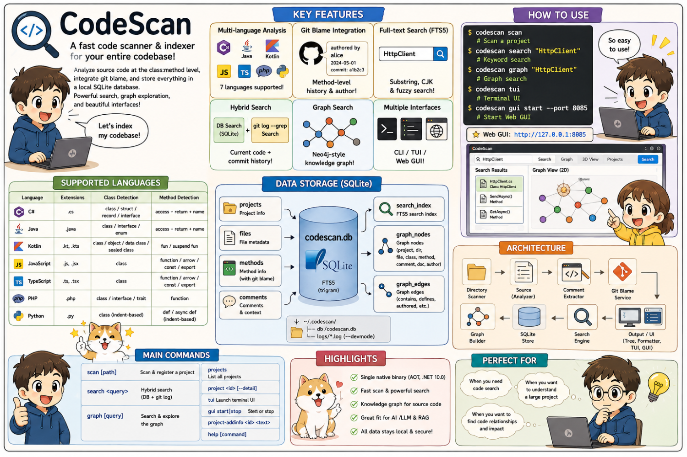
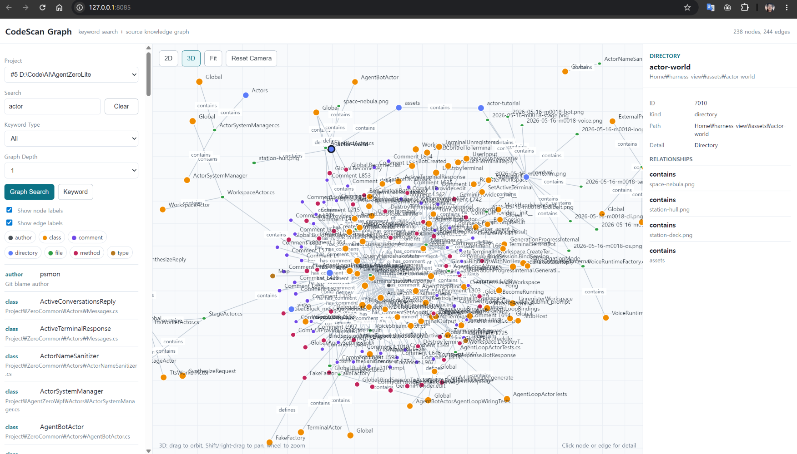
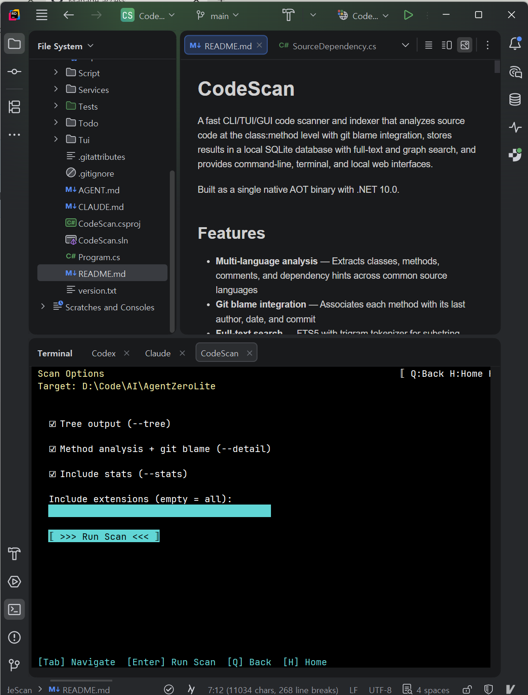
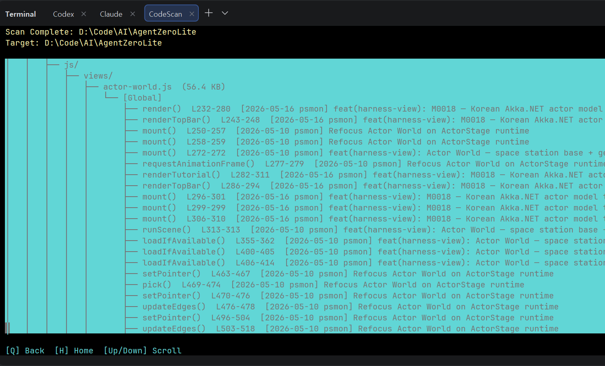

# CodeScan

> English · [한국어](README-KO.md)

A fast CLI/TUI/GUI code scanner and indexer that analyzes source code at the class:method level with git blame integration, stores results in a local SQLite database with full-text and graph search, and provides command-line, terminal, and local web interfaces.

Built as a single native AOT binary with .NET 10.0.

<p align="center">
  
</p>

## Features

- **Multi-language analysis** — Extracts classes, methods, comments, and dependency hints across common source languages
- **Git blame integration** — Associates each method with its last author, date, and commit
- **Full-text search** — FTS5 with trigram tokenizer for substring and CJK language support
- **Hybrid search** — Combines indexed DB search with live `git log --grep` results
- **Graph search** — Neo4j-style source knowledge graph stored in embedded SQLite
- **Cypher-like graph query** — Safe `MATCH ... WHERE ... LIMIT ...` subset for structured graph retrieval
- **Hybrid dependency graphing** — Regex-first dependency edges, with language/project metadata probes for future semantic analyzers
- **Interactive TUI** — Terminal.Gui v2 interface for browsing, scanning, keyword search, graph search, and graph query
- **Local web GUI** — Keyword search, graph search/query, interactive 2D graph exploration, and controllable 3D view on port 8085 by default
- **Project management** — Register, describe, update, and delete indexed projects
- **Single binary** — Native AOT compiled, no runtime dependency required

## Screenshots

### Web GUI Graph Viewer

The local GUI provides keyword search, graph search, node/edge detail inspection, 2D graph controls, and a camera-controlled 3D graph view.



### Terminal UI

The TUI supports project browsing, scanning, project management, keyword search, and graph search from the terminal.



### TUI Scan Flow

Scanning can be launched from the terminal interface with method/comment extraction, git blame enrichment, and DB graph indexing.



## Supported Languages

| Language | Extensions | Class / Type Detection | Method Detection | Dependency Hints |
|----------|-----------|------------------------|------------------|------------------|
| C# | `.cs` | class / struct / record / interface | access + return + name | using, inheritance/interface, `new`, type usage |
| Java | `.java` | class / interface / enum | access + return + name | import, extends/implements, `new`, type usage |
| Kotlin | `.kt`, `.kts` | class / object / data class / sealed class | fun / suspend fun | import, base type, constructor/type usage |
| JavaScript | `.js`, `.jsx` | class | function / arrow / const / export | import, extends/implements-style hints, `new`, type-like usage |
| TypeScript | `.ts`, `.tsx` | class | function / arrow / const / export | import, extends/implements, `new`, type annotations |
| PHP | `.php` | class / interface / trait | function | use, extends/implements, `new`, type hints |
| Python | `.py` | class (indent-based) | def / async def (indent-based) | import, base class, constructor-like calls |
| Go | `.go` | type struct/interface | graph dependency scan only | import, constructor/type usage |
| Rust | `.rs` | struct / enum / trait | graph dependency scan only | use, associated constructor/type usage |
| C/C++ | `.c`, `.cc`, `.cpp`, `.cxx`, `.h`, `.hpp`, `.hh`, `.hxx` | class / struct | graph dependency scan only | include, inheritance, `new`, type usage |

## Installation

<p align="center">
  
</p>

<p align="center"><sub>One release pipeline → four native binaries → three package channels. <a href="https://github.com/psmon/CodeScan/actions/workflows/release.yml">GitHub Actions release.yml</a></sub></p>

### Easy Install — one line per OS

| OS | Architecture | Primary command | Alternative |
|----|--------------|-----------------|-------------|
| **Windows** | x64 | `winget install psmon.CodeScan` | `npm install -g @psmon/codescan-cli` (if Node is already installed) |
| **macOS** | arm64 (Apple Silicon) | `brew install psmon/codescan/codescan` | — |
| **Linux** | x64 / arm64 | `npm install -g @psmon/codescan-cli` | — |

> **⚠ Important: install the scoped name `@psmon/codescan-cli`.**
> An unrelated third party squatted the bare `codescan-cli` name on npm
> before we published. That package is broken (its own ESM/CJS mismatch
> crashes on `codescan` launch) and has nothing to do with CodeScan.
> If you installed it by mistake, run `npm uninstall -g codescan-cli`
> first, then install `@psmon/codescan-cli` above.

After install, verify:

```bash
codescan --version   # should print: codescan v0.5.0 (or newer)
codescan --help
```

> **Channel status (v1)**
> The GitHub Release pipeline is live and produces the binaries every channel pulls from.
> · **Homebrew tap** — live at [`psmon/homebrew-codescan`](https://github.com/psmon/homebrew-codescan). `brew tap psmon/codescan && brew install codescan` works today on Apple Silicon Macs.
> · **winget** — manifest at [`packaging/winget/manifests/p/psmon/CodeScan/`](packaging/winget/manifests/p/psmon/CodeScan/), pending PR to `microsoft/winget-pkgs`. Until merged, test locally — see [Testing winget locally on Windows](#testing-winget-locally-on-windows) below.
> · **npm (`@psmon/codescan-cli`)** — package at [`packaging/npm/codescan-cli/`](packaging/npm/codescan-cli/), pending publish to npm registry. The bare `codescan-cli` name is held by an unrelated third party — always use the scoped name above.
> Until each channel goes live, the [direct installers](#direct-installer-fallback) below work today.

#### Testing winget locally on Windows

The winget manifest is generated for every release. To install from a local manifest file (before the PR to `microsoft/winget-pkgs` is merged), winget requires a one-time opt-in. **Run once in an elevated PowerShell**:

```powershell
winget settings --enable LocalManifestFiles
```

Then install from the in-repo manifest (no admin needed after the opt-in):

```powershell
# from a fresh clone of this repo
winget install --manifest packaging\winget\manifests\p\psmon\CodeScan\0.5.0
codescan --version
```

This is winget's built-in safety guard against arbitrary-yaml installs — once enabled, you can install / validate any local manifest. To disable later: `winget settings --disable LocalManifestFiles` (elevated).

#### Why each channel?

- **winget (Windows)** — Microsoft's native Windows package manager. Portable install, no admin needed, PATH handled automatically.
- **Homebrew (macOS)** — De-facto package manager for macOS developers. v1 ships **arm64 only** (Apple Silicon); Intel Mac users should build from source or use Rosetta with the arm64 build. Intel Mac shipping is a v2 candidate.
- **npm (Linux + Windows alternative)** — Picked over apt/dnf/snap because npm is universally available across Linux distros and the CodeScan release pipeline can serve **all four binaries** (`linux-x64`, `linux-arm64`, `osx-arm64`, `win-x64`) from a single wrapper package. The npm package is a thin postinstall wrapper that downloads the right native binary from GitHub Releases. On Windows, `winget` stays the recommended path (no Node.js required), but `npm install -g @psmon/codescan-cli` also works if you already have Node and want toolchain consistency. **Use the scoped name `@psmon/codescan-cli`** — the bare `codescan-cli` name is squatted by an unrelated, broken third-party package. **Linux arm64 is a deliberate first-class target** — see [Why AOT? — Edge AI trend and the value of a single binary](#why-aot--edge-ai-trend-and-the-value-of-a-single-binary) at the bottom of this README for why arm64 SBC (Raspberry Pi / Jetson / Latte Panda) deployment is a key forward-looking scenario for this tool.

### Linux: x64 vs arm64

The npm wrapper auto-detects your CPU architecture and downloads the matching tarball:

| `process.arch` | Asset downloaded |
|----------------|------------------|
| `x64` | `codescan-linux-x64.tar.gz` |
| `arm64` | `codescan-linux-arm64.tar.gz` |

If `postinstall` cannot reach GitHub (corporate proxy, air-gapped), set `CODESCAN_SKIP_DOWNLOAD=1` during install and grab the binary manually from the [latest release](https://github.com/psmon/CodeScan/releases/latest).

v1 ships **glibc-based Linux only**. musl/Alpine support is a v2 candidate.

### Direct installer (fallback)

For environments without a package manager — or when you want to pin to a specific release.

**Windows (PowerShell):**

```powershell
iwr https://raw.githubusercontent.com/psmon/CodeScan/main/Script/install-win.ps1 -OutFile install-win.ps1
.\install-win.ps1                       # latest
.\install-win.ps1 -Version 0.5.0        # pinned
```

**Linux / macOS (bash):**

```bash
curl -fsSL https://raw.githubusercontent.com/psmon/CodeScan/main/Script/install.sh -o install.sh
sh install.sh                           # latest
sh install.sh --version 0.5.0           # pinned
```

Both installers download the matching release asset from GitHub, verify SHA256 against `checksums.txt`, install to a user-local path (Win: `~/.codescan/bin`, Unix: `~/.local/bin`), and **never touch user data** under `~/.codescan/{db,logs,config}`.

### User data location

| OS | Binary install path | User data |
|----|--------------------|-----------|
| Windows | `%USERPROFILE%\.codescan\bin` (or winget-managed) | `%USERPROFILE%\.codescan\{db,logs,config}` |
| Linux | `~/.local/bin` (or npm-managed) | `~/.codescan/{db,logs,config}` |
| macOS | `$(brew --prefix)/bin` | `~/.codescan/{db,logs,config}` |

User data is preserved across install / upgrade / uninstall.

### Build from source

```bash
git clone https://github.com/psmon/CodeScan.git
cd CodeScan
dotnet build                        # debug build
dotnet publish -c Release           # release publish (single-file)
```

Prerequisites:

- [.NET 10.0 SDK](https://dotnet.microsoft.com/) (for building)
- Git (for blame integration)

Output: `bin/Release/net10.0/<rid>/codescan` (or `codescan.exe` on Windows).

### Developer deploy scripts

For repo developers who want to bypass GitHub Releases and install directly from a local checkout:

- **Windows:** `Script/deploy-win.ps1`
- **Linux:** `Script/deploy-linux.sh`

These do `dotnet publish` + install to `~/.codescan/bin` + register PATH — handy during local development but not the recommended path for users.

### Distribution strategy details

See [`Docs/install-distribution-strategy.md`](Docs/install-distribution-strategy.md) for the v1 confirmed plan (asset naming, signing posture, SBOM, CI flow, channel submission procedures).

## Usage

### Quick Start

```bash
# Scan current directory (register + analyze + display)
codescan scan

# Scan a specific path
codescan scan /path/to/project

# Search across all indexed projects
codescan search "HttpClient"

# Graph search
codescan graph "HttpClient"
codescan search "HttpClient" --graph --depth 2

# Cypher-like graph query
codescan query "MATCH (c:class)-[r:uses_type]->(t:type) WHERE t.label = 'HttpClient'"

# Launch interactive TUI
codescan tui

# Start local GUI viewer
codescan gui start --port 8085
```

### CLI Commands

| Command | Description |
|---------|-------------|
| `scan [path]` | Register and analyze a directory (shortcut for list with defaults) |
| `list <path>` | Scan with custom filtering and output options |
| `search <query>` | Hybrid full-text + git log search |
| `graph [query]` | Search and inspect source knowledge graph |
| `query <graph-query>` | Run the CodeScan Cypher-like graph query subset |
| `cypher <graph-query>` | Alias for `query` |
| `gui start|stop` | Start or stop the local web GUI viewer |
| `projects` | List all registered projects with stats |
| `project <id>` | Show project summary or `--detail` for full view |
| `project-addinfo <id> <text>` | Add an AI-friendly description to a project |
| `project-update <id>` | Update project path or description |
| `project-delete <id>` | Remove a project from the database |
| `tui` | Launch interactive terminal UI |
| `help [command]` | Show help for a specific command |

### Search Options

```bash
# Search methods
codescan search "async" --type method

# Search comments
codescan search "TODO" --type comment

# Search within a specific project
codescan search "config" --project 1

# Search the graph
codescan search "HttpClient" --graph --depth 2
codescan graph "SearchCommand" --project 1

# Treat a search argument as a graph query
codescan search "MATCH (f:file)-[r:imports]->(m:module) LIMIT 20" --query
```

### Graph Query

CodeScan supports a Cypher-like query subset for the graph data it actually stores. It is designed for CLI users, AI agents, and automation scripts that need structured graph retrieval without direct SQL access.

This is not full Cypher. It maps to CodeScan's SQLite-backed source graph and returns a `GraphData` result that CLI, TUI, and GUI can render.

Supported patterns:

```cypher
MATCH (n:kind)
MATCH (a:kind)-[r:edge_kind]->(b:kind)
```

Supported `WHERE` fields:

| Alias Type | Fields |
|------------|--------|
| Node aliases | `kind`, `label`, `path`, `detail` |
| Edge aliases | `kind`, `label` |

Supported operators:

| Operator | Example |
|----------|---------|
| `=` | `t.label = 'HttpClient'` |
| `CONTAINS` | `c.label CONTAINS 'Command'` |
| `STARTS WITH` | `m.label STARTS WITH 'System'` |
| `ENDS WITH` | `f.path ENDS WITH '.cs'` |

Supported clauses:

| Clause | Behavior |
|--------|----------|
| `WHERE ... AND ...` | Filters matched nodes/edges |
| `RETURN ...` | Accepted for readability, ignored by the renderer |
| `LIMIT <n>` | Limits matched seed nodes/edges |

Examples:

```bash
# Find class nodes
codescan query "MATCH (c:class) WHERE c.label CONTAINS 'Service' LIMIT 20"

# Find classes that use a type
codescan query "MATCH (c:class)-[r:uses_type]->(t:type) WHERE t.label = 'HttpClient'"

# Find file imports
codescan query "MATCH (f:file)-[r:imports]->(m:module) WHERE m.label CONTAINS 'System.Net'"

# Find author-to-method relationships and expand one neighbor hop
codescan query "MATCH (a:author)-[r:authored]->(m:method) WHERE a.label CONTAINS 'kim'" --depth 1

# `graph` auto-detects MATCH queries
codescan graph "MATCH (c:class)-[r:creates]->(t:type) LIMIT 30"
```

Common node kinds:

`project`, `directory`, `file`, `class`, `method`, `comment`, `doc`, `author`, `type`, `module`

Common edge kinds:

`contains`, `defines`, `authored`, `has_comment`, `documents`, `imports`, `inherits_or_implements`, `creates`, `uses_type`

### GUI

```bash
# Start on the default port
codescan gui start

# Start on a custom port
codescan gui start --port 8090

# Stop the GUI server
codescan gui stop
```

Open `http://127.0.0.1:8085/` after starting the GUI. The viewer provides keyword search, graph search, Cypher-like graph query, a Neo4jClient-like 2D graph canvas, and a controllable 3D graph view.

GUI graph controls:

| Control | Behavior |
|---------|----------|
| `Keyword` | Run full-text keyword search |
| `Graph Search` | Search graph nodes by keyword and expand neighbors |
| `Query` | Run `MATCH ...` graph query and render the result |
| 2D drag background | Pan the graph |
| 2D mouse wheel | Zoom around the cursor |
| 2D drag node | Reposition a node |
| Node click | Show node detail and visible relationships |
| Edge click | Show relationship detail |
| Legend chips | Toggle node kinds on/off |
| `Fit` | Fit visible nodes into the canvas |
| `Reset Camera` | Reset 2D viewport or 3D camera |
| 3D drag | Orbit camera |
| 3D Shift-drag / right-drag | Pan camera |
| 3D mouse wheel | Zoom camera |

### List Options

```bash
# Tree view with method details
codescan list /path/to/project --detail --tree

# Filter by extension
codescan list /path --include .ts,.tsx

# Limit depth and include git blame
codescan list /path --depth 3 --blame
```

## Data Storage

All data is stored under `~/.codescan/`:

```
~/.codescan/
├── db/
│   └── codescan.db      # SQLite database with FTS5 index
└── logs/
    └── *.log            # Scan logs (--devmode only)
```

### Database Tables

| Table | Contents |
|-------|----------|
| `projects` | Indexed projects with path, scan date, stats |
| `scans` | Scan history per project |
| `files` | File metadata (path, size, extension, depth) |
| `methods` | Class:method definitions with git blame data |
| `comments` | Comment blocks with surrounding code context |
| `project_docs` | Auto-discovered README / AGENT / CLAUDE.md content |
| `search_index` | FTS5 virtual table (trigram tokenizer) |
| `graph_nodes` | Source graph nodes: projects, directories, files, classes, methods, comments, docs, authors |
| `graph_edges` | Source graph relationships: contains, defines, authored, documents, comments, imports, creates, uses_type, inherits_or_implements |

### Graph Edge Rules

Structural edges:

| Edge | Meaning |
|------|---------|
| `project -[contains]-> directory/file` | Project file tree |
| `directory -[contains]-> directory/file` | Directory file tree |
| `file -[contains]-> class` | Class/type found in a source file |
| `class/file -[defines]-> method` | Method/function definition |
| `file -[has_comment]-> comment` | Comment block found in a source file |
| `author -[authored]-> method` | Git blame last-author relationship |
| `project -[documents]-> doc` | Auto-discovered project document |

Dependency hint edges:

| Edge | Source |
|------|--------|
| `file/class -[imports]-> module` | `using`, `import`, `use`, `#include` |
| `class -[inherits_or_implements]-> type` | Base class / interface / trait-style declarations |
| `class -[creates]-> type` | Constructor or constructor-like calls such as `new Type()` |
| `class -[uses_type]-> type` | Type annotations, fields, parameters, returns, or local declarations detected by regex strategy |

The dependency graph is intentionally hybrid. CodeScan first uses language-neutral regex strategies so graph edges exist even when the project cannot be built. It also probes for semantic analysis capability using project metadata:

| Language | Semantic Probe |
|----------|----------------|
| C# | `.sln`, `.csproj` for future Roslyn analyzers |
| Java | `pom.xml`, `build.gradle`, `build.gradle.kts` for future JDT/Spoon analyzers |
| TypeScript/JavaScript | `tsconfig.json`, `jsconfig.json` for future TypeScript Compiler API analyzers |
| Go | `go.mod`, `go.work` for future `go/packages` analyzers |
| Rust | `Cargo.toml` for future rust-analyzer/Cargo metadata analyzers |
| C/C++ | `compile_commands.json` for future Clang LibTooling analyzers |

Current semantic probes detect whether the required project model exists; regex remains the active fallback until a language-specific semantic strategy is added.

## Architecture

```
CodeScan/
├── Program.cs                  # Entry point and CLI routing
├── Commands/                   # Command implementations
├── Models/                     # Data structures (FileEntry, MethodEntry, CommentBlock, SourceDependency)
├── Services/                   # Core logic
│   ├── DirectoryScanner.cs     #   Recursive traversal with filtering
│   ├── SourceAnalyzer.cs       #   Multi-language class/method extraction
│   ├── SourceGraphAnalyzer.cs  #   Hybrid dependency edge extraction
│   ├── CommentExtractor.cs     #   Comment extraction with context
│   ├── GitBlameService.cs      #   Git blame per method
│   ├── GitLogSearchService.cs  #   Hybrid git log search
│   ├── GraphQuery.cs           #   Cypher-like MATCH query parser
│   ├── GraphModels.cs          #   Source graph DTOs
│   ├── SqliteStore.cs          #   SQLite DB with FTS5 full-text search
│   └── TreeFormatter.cs        #   Tree/flat output formatting
├── Tui/
│   └── TuiApp.cs               # Terminal.Gui v2 interactive UI
└── Script/                     # Deployment scripts (Windows/Linux)
```

## Dependencies

| Package | Purpose |
|---------|---------|
| [Microsoft.Data.Sqlite](https://www.nuget.org/packages/Microsoft.Data.Sqlite) | Embedded SQLite with FTS5 support |
| [Terminal.Gui v2](https://github.com/gui-cs/Terminal.Gui) | Cross-platform terminal UI framework |

## Design Highlights

- **Centralized storage** — All data under `~/.codescan/` regardless of where the tool is run
- **Recent-first sorting** — Files and directories sorted by modification time (newest first)
- **Smart defaults** — `.git`, `node_modules`, `bin`, `obj`, `dist`, `build`, `__pycache__` excluded automatically
- **Markdown always included** — `.md` files are always indexed even when `--include` filters are active
- **Git root detection** — Walks directory tree to find `.git/` without spawning subprocesses
- **Trigram FTS** — Enables effective substring search for CJK languages (Korean, Chinese, Japanese)
- **Regex-first graphing** — Produces dependency graph hints without requiring a successful build
- **Semantic-ready strategy layer** — Language-specific compiler analyzers can be added behind `ISourceDependencyStrategy`

## Why AOT? — Edge AI trend and the value of a single binary

> **TL;DR** — Through 2026 and into 2027, AI infrastructure is shifting from cloud-hosted frontier models toward *on-device SLMs (Small Language Models)* and *edge agents*. CodeScan is a .NET 10 Native AOT build — a **single binary with no runtime dependency** — designed to ride that wave: the same artifact runs on a developer laptop, a Raspberry Pi, or a drone-grade SBC.

### 2026: the year SLMs actually started running on the edge

Up to 2025, "edge LLM" was mostly demoware and benchmark posts. 2026 is when that changed:

- **Google Gemma 3 / 3n / 3 270M** — Gemma 3 has been measured at **14.5 tok/s on a Raspberry Pi** and survived a **12-hour Jetson run** with no memory leak or slowdown. The 270M variant uses just **0.75% of a Pixel 9 Pro battery for 25 conversations** thanks to INT4 quantization and Per-Layer Embedding (PLE) caching — small enough to land naturally on everyday devices. ([Gemma 3 270M announcement](https://developers.googleblog.com/en/introducing-gemma-3-270m/), [Gemma 3n overview](https://ai.google.dev/gemma/docs/gemma-3n))
- **NVIDIA Nemotron 3 Nano (4B and 30B-A3B)** — A hybrid Mixture-of-Experts design: 30B total parameters but only **3B active per forward pass**. The 4B variant, quantized to 4-bit, fits under **3 GB of VRAM** and runs on consumer RTX cards and Jetson-class edge boards. NVIDIA claims **9× throughput** over comparable open models. ([Nemotron 3 Nano Omni announcement](https://developer.nvidia.com/blog/nvidia-nemotron-3-nano-omni-powers-multimodal-agent-reasoning-in-a-single-efficient-open-model/), [Nemotron 3 Nano 4B hybrid architecture](https://news.skrew.ai/nvidia-nemotron-3-nano-4b-hybrid-architecture-edge-ai/))
- **3B parameters as the 2026 sweet spot** — With production-grade 3–8 bit quantization and a fresh wave of small NPUs landing on single-board computers, the community has converged on **~3B parameters as the practical sweet spot for SBC inference**. ([The Small Model Revolution 2026](https://dev.to/linou518/the-small-model-revolution-2026-3b-parameters-on-raspberry-pi-edge-ais-new-sweet-spot-3pp4))

### 2027 prediction: small devices ship with an LLM *by default*

Extrapolating the curve, the following is likely to be the 2027 baseline:

- **Drones** — Whisper-class speech recognition + a 3B-class SLM handles autonomous mission parsing and replanning without GPS — moving from academic demos to production payloads.
- **Raspberry Pi 5 + AI HAT+ 2** — The Hailo-10H accelerator (**40 TOPS INT4**) and 8 GB LPDDR4X turn an SBC into a real LLM host. ([Raspberry Pi AI HAT+ 2 release — The Register, Jan 2026](https://www.theregister.com/2026/01/15/pi_5_ai_hat_2/))
- **x86/ARM SBCs (Latte Panda, Khadas Edge, Orange Pi, …)** — Sitting next to PLCs on the factory floor, local SLMs handle log triage, anomaly detection, and natural-language operator UIs.
- **Laptops and tablets** — NPU-equipped SoCs (Apple Silicon, Snapdragon X, AMD Strix Halo) make 4B-class on-device inference an **OS-level default**. Samsung, Google, and Motorola's 2026 flagships already ship support for 4B models at Q4 quantization. ([2026 SLM comparison: Phi-4 vs Gemma 3 vs Qwen](https://aegisai.in/best-small-language-models-for-edge-devices-2026-slm-comparison-phi-4-gemma-3-qw/))

All of these targets share the same **structural constraints**:

| Constraint | Implication |
|------------|-------------|
| **No runtime present** — drone firmware and SBC minimal images rarely carry a .NET / Java / Python runtime, and adding one is expensive | A single self-contained binary is effectively a requirement |
| **Memory and storage pressure** — the model already owns most of the RAM; surrounding tools must be small | AOT trimming and single-file compression matter |
| **Cold-start cost** — battery-powered and event-triggered workloads must respond immediately | "No JIT warmup" is a decisive advantage |
| **Supply-chain trust** — edge updates are infrequent, so the integrity of the artifact you ship matters more | Single file + SHA256 + SBOM is a natural fit |

### Where Native AOT single-binary fits

CodeScan's build shape lines up with each of those constraints:

- **Instant startup (no JIT)** — Decisive when an edge agent must respond within ~50 ms of a voice trigger. ([Native AOT deployment overview — Microsoft Learn](https://learn.microsoft.com/en-us/dotnet/core/deploying/native-aot/))
- **Runtime-free single file** — Copy a single `~/.codescan/bin/codescan` and it runs on a Raspberry Pi with no .NET installed.
- **Smaller memory footprint** — AOT drops the JIT, its metadata, and unreachable runtime services, leaving more RAM for the model.
- **Reduced attack surface** — Dynamic code generation and most reflection paths are stripped; pairing a single file with an SBOM is friendly to supply-chain audit.
- **First-class multi-arch** — From v1 the same pipeline publishes `linux-x64`, `linux-arm64`, `osx-arm64`, and `win-x64` as peer artifacts. SBC deployment needs no separate build procedure.

### CodeScan's role in an edge-AI workflow

CodeScan does not host an LLM itself. It is the **indexing and retrieval layer** an agent needs whenever it has to interact with a codebase:

- An FTS5 + graph backend that lets a code-aware agent (e.g., Gemma 3 4B with tool-use) on an SBC sweep a local repository quickly.
- A Cypher-like graph-query surface that an autonomous build/deploy bot can use to reason about change impact.
- A RAG-lite component for drone or robot SDK repos — analyze offline, then feed code context into the SLM.

#### Companion project: AgentZeroLite

The "agent" half of the picture is being built in parallel as a sibling research project — [**psmon/AgentZeroLite**](https://github.com/psmon/AgentZeroLite). AgentZeroLite focuses on **running and evaluating on-device SLMs** (the Gemma 3 / Nemotron Nano-class models discussed above) on real consumer-grade hardware, while CodeScan acts as the code-aware retrieval layer those agents call into. The two are designed to compose:

- **AgentZeroLite** — hosts the on-device model, manages prompting, tool-use, and evaluation loops for edge inference scenarios.
- **CodeScan** — answers "what's in this codebase?" with FTS5 keyword hits, the source graph, and Cypher-like queries — the kind of structured context an SLM needs to do useful code work without a frontier model.

If you want to see how this plays out end-to-end (on-device SLM ↔ structured code retrieval), AgentZeroLite is the natural next stop.

In short — **as small models start doing real work on the edge, the *tooling* around those models has to be small, instant, and runtime-free too**. A Native AOT single binary is the most direct answer to that requirement, and CodeScan is built along that line.

> For the full build/distribution spec, see [`Docs/install-distribution-strategy.md`](Docs/install-distribution-strategy.md).

## License

See repository for license information.
